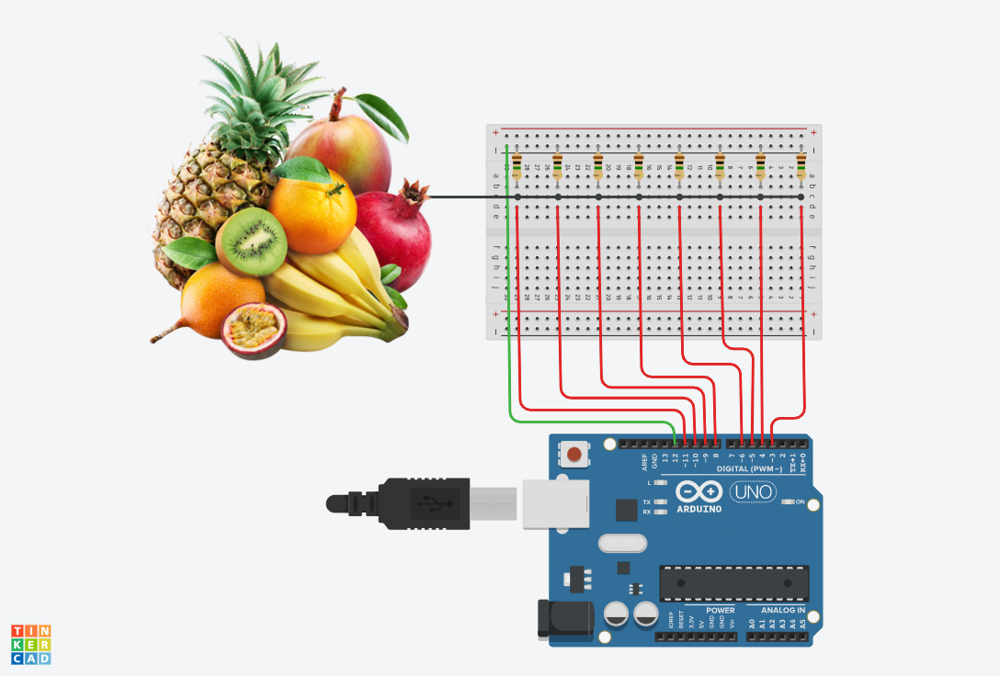

# FreshFruitMIDI

## Material utilizado

* Arduino (Nano)
* 8 resistências 1 Mohm
* cabos
* fruta à descrição

## Software utilizado

* Arduino IDE
* hairless-midiserial
* Ableton Live 11
* Autodesk Thinkercad Circuits

## Circuito

